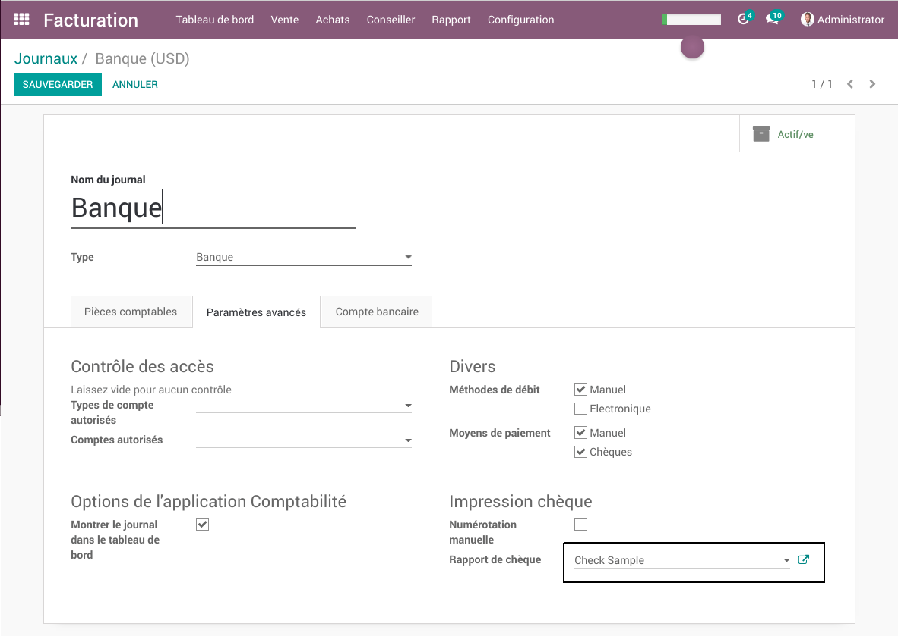

Aeroo Check Printing
====================

This module allows creating check reports using Aeroo.

Each journal (bank account) points to its own specific check report template.
When clicking on 'Print Check' on the payment, the appropriate Aeroo template is selected.

Configuration
-------------
To define an Aeroo report as the check report:

* Go to Invoicing / Configuration / Journals
* Select your bank/check journal
* In the Advanced Settings tab, under Check Printing, select your check report template.

Contributors
------------
* Numigi (tm) and all its contributors (https://bit.ly/numigiens)

More information
----------------
* Meet us at https://bit.ly/numigi-com
