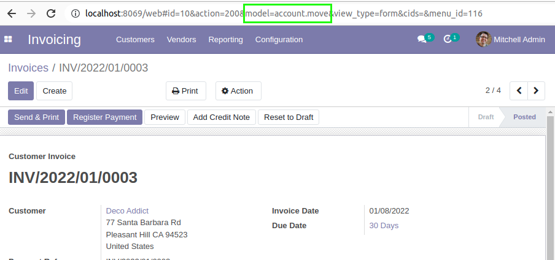

=============
Aeroo Reports
=============
This module is the main module required for using Aeroo reports.

.. contents:: Table of Contents

Context
=======

Qweb
----
Odoo comes with a native reporting engine called ``Qweb``.
This engine is very good for some kind of reports.
When you need a web report with dynamic behavior, qweb is an appropriate choice.

However, qweb has weaknesses when rendering PDF documents, such as invoices, quotations and delivery slips.

First, Qweb templates are hard to customize and maintain.

Second, a Qweb report has a single template for all languages.
The translations are edited separately and injected in the template at rendering.
When making a change to a template, you must verify that it renders appropriately for all active translations.

The most major point is portability of reports between major versions of Odoo.
When migrating your system to an earlier version, you want to minimize the time required to port your reports.

Aeroo
-----
Aeroo is an alternative to Qweb.

It uses ``Libreoffice`` documents as templates.
It aims to offer lattitude to the end user regarding the look of a report.

.. image:: static/description/libreoffice_invoice.png

The report can be rendered as ``PDF``.

.. image:: static/description/libreoffice_invoice_pdf.png

Installation
============
There are two linux packages required for running this module.

.. code-block:: bash

    sudo apt-get update && apt-get install -y --no-install-recommends \
        libreoffice-writer \
        poppler-utils

The module uses `libreoffice-writer <https://fr.libreoffice.org/discover/writer/>`_ in headless mode for rendering the reports.

When reports in pdf format for multiple records (in list view) it uses `poppler-utils <https://poppler.freedesktop.org>`_
to merge the rendered reports into a single pdf.

See the Dockerfile on this repository for details.

Configuration
=============
Aeroo reports can be found under the ``Dashboard`` application.

.. image:: static/description/aeroo_report_menu.png

When configuring an aeroo report, multiple parameters must be defined.

Name
----
The field ``Name`` is the label that will appear on the print button.

.. image:: static/description/invoice_print_button.png

Model
-----
This is the technical value that links the report with a given type of document.

In the example, the model is an invoice, so the technical value is ``account.move``.
This technical value can be found in the url of the form view.

Template Name
-------------
This is a technical value that identifies your report in Odoo.
The given value is arbitrary.

You should choose a value with no accent, no special caracters and no space.
Only letters and underscores.

The value must be unique throughout the system.

Template Mime-type
------------------
This field identifies the type of template.

.. image:: static/description/report_template_mime_type.png

Output Mime-type
----------------
Three formats are available for the generated report.

.. image:: static/description/report_output_mime_type.png

Typically, a report is printed as ``PDF``.

However, for testing a report, rendering as ``ODT`` can be useful.

Otherwise, rendering as ``Microsoft Word`` can be useful in case you
need to edit the document manually before printing it as ``PDF``.

Contributors
============
* Alistek
* Savoir-faire Linux
* Numigi (tm) and all its contributors (https://bit.ly/numigiens)
