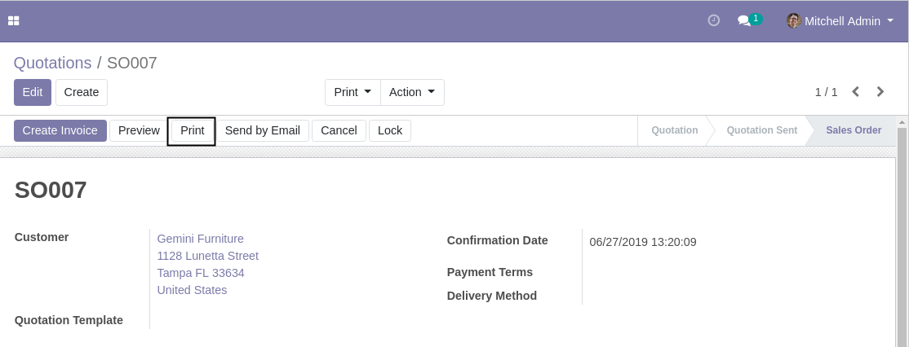
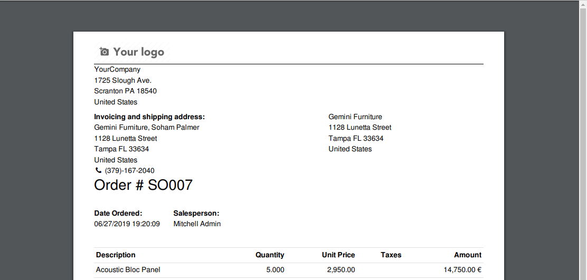
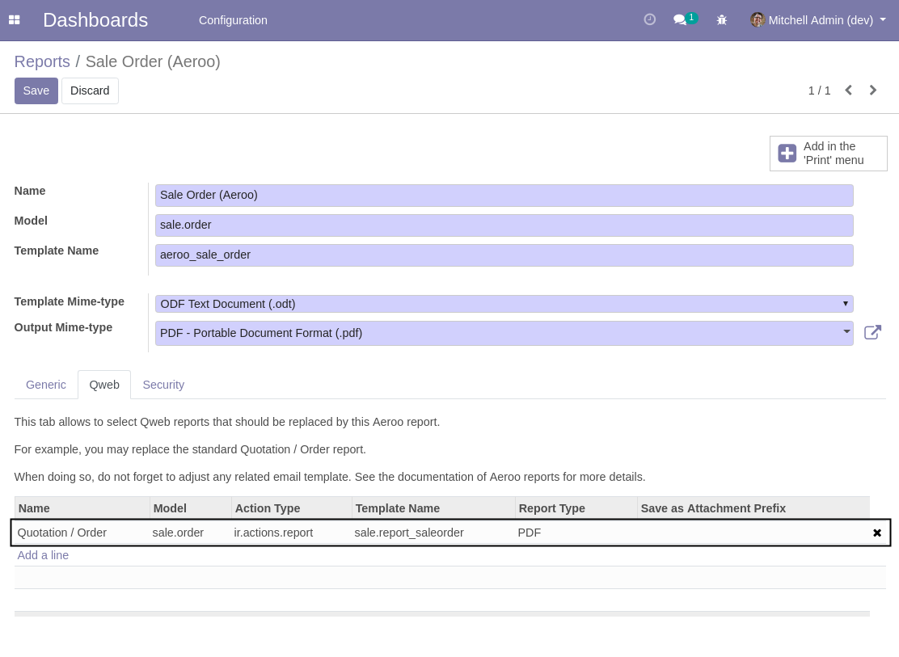
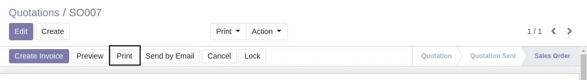
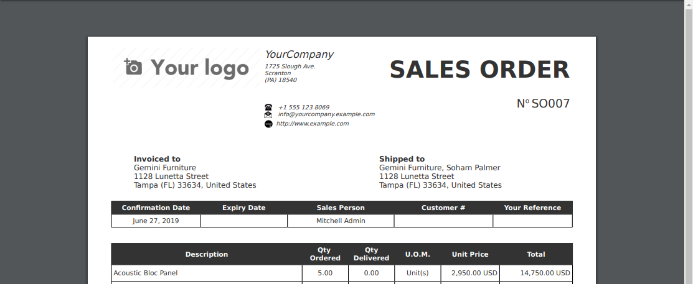
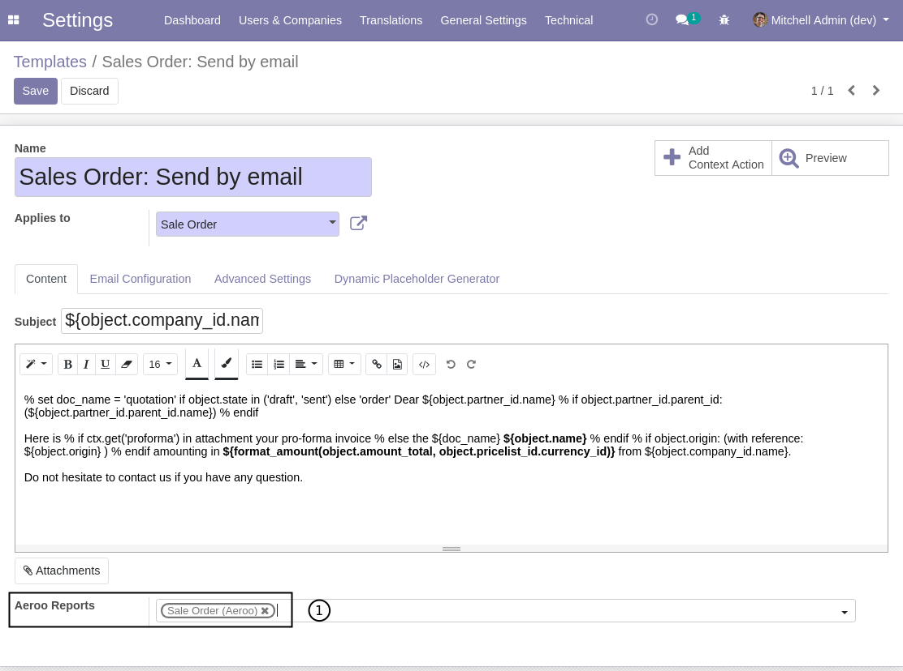
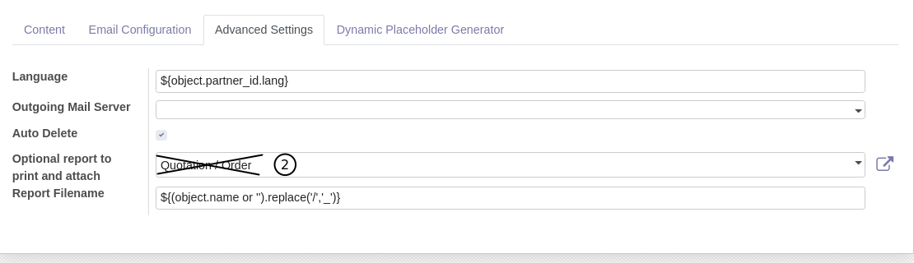

Report Aeroo Replace Qweb
=========================

.. contents:: Table of Contents

Context
-------
Most Odoo applications come with a predefined set of Qweb reports.

These reports are linked to 'PRINT' action buttons in form views and portal pages.

Summary
-------
This module allows to replace an existing Qweb report with an Aeroo report.

Usage
-----
To do so, go to the form view of your aeroo report.

Inside the Qweb tab, select the report to replace.

Now, when printing the original report, the new aeroo report is printed instead.

Do not forget to add your aeroo report to the related email templates.

More information
----------------
* Meet us at https://bit.ly/numigi-com
